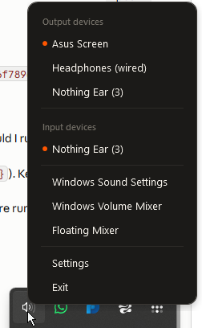

  

> **Windows only** — requires Windows 10 or later.

System tray utility for switching audio devices and controlling per-app volume. Lives in the taskbar notification area.

  

- Switch default **output device** (speakers/headphones) from the tray
- Switch default **input device** (microphone) from the tray
- Per-app **volume control** — set levels independently per running app
- **Floating mixer** — detachable volume panel
- Adapts to Windows **light and dark** theme

## Download

[→ Latest release](https://github.com/jjffjjff/AudioInOut/releases/latest)

Download the `.zip`, extract it, and run `AudioInOut.exe` — no installer needed.

## Credits and license

AudioInOut is a fork of [EarTrumpet](https://github.com/File-New-Project/EarTrumpet) by Rafael Rivera, Dave Amenta and contributors. Released under the [MIT License](LICENSE) (includes upstream's Excluded Entities clause).
